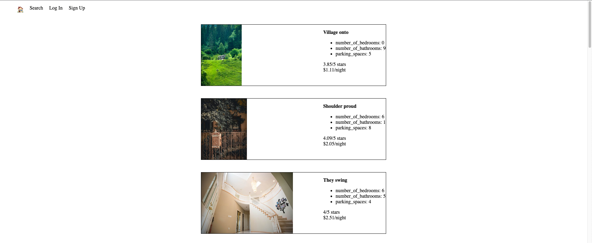

# LightBnB

LightBnB is a small AirBnB clone that we build in weeks 12-13 during the Lighthouse Labs bootcamp to help students practice our relational database skills with PostgresSQL.

## Features

- Add property
- Filter properties based on various options
- Register a new user and adding it to database
- Login with that user

## Final Product

Homepage

Search

Login

Sign Up

## Dependencies

- bcrypt
- body-parser
- cookie-sesion
- Express
- nodemon
- pg

## Getting Started

- cd into LighthouseBnB/Light_BnB_WebApp-master
- Install all dependencies (using the `npm install` command)
- Start server with `npm run local`
- View at localhost:3000 in browser
